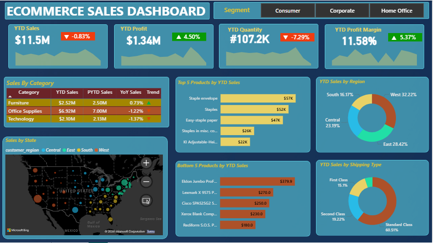

# E-Commerce-Sales-Dashboard
Developed an interactive Power BI Sales Dashboard for a US-based e-commerce company to track YTD performance, analyze growth trends, and uncover insights across customers, products, regions, and shipping types.

## 🎯 Project Objective
To analyze year-to-date (YTD) sales performance and generate actionable insights by tracking key KPIs, identifying growth trends, and evaluating business performance across multiple dimensions.

## Datasets used
- <a href="https://github.com/VaishnaviA-hub/E-Commerce-Sales-Dashboard/blob/main/data/ecommerce_data.csv"> ECommerce_Data </a>
- <a href="https://github.com/VaishnaviA-hub/E-Commerce-Sales-Dashboard/blob/main/data/us_state_long_lat_codes.csv"> US_State_Long_Lat_Codes </a>

## ❓ Questions
1. What are the YTD Sales, Profit, Quantity Sold, and Profit Margin?
2. How are KPIs performing year-over-year (YoY)?
3. What are the YTD vs PYTD sales trends across customer categories?
4. Which states and regions are performing best/worst?
5. What are the top 5 and bottom 5 products by sales?
6. Which shipping type contributes the most to sales?

## ⚙️ Process
- Cleaned and transformed raw data using Power Query.
- Built data model with relationships across ecommerce_data, us_state_long_lat_codes and Calendar datasets.
- Created DAX measures for YTD, PYTD, YoY growth, and profit margin calculations.
- Designed KPI cards with sparklines for trend visualization.
- Developed interactive visuals for state, region, product, and shipping-level analysis.

## Dashboard: US E-Commerce Sales Dashboard

## 🔍 Project Insights
The analysis reveals that **Office Supplies dominates overall sales (~$6.92M)**, but its negative YoY growth indicates a potential slowdown in demand. **Furniture shows stable performance with slight growth, while Technology underperforms**, highlighting key areas for improvement.

At the product level, revenue is **concentrated among a few top-performing items** like Staple Envelope and Staples, indicating dependency on limited SKUs. Geographically, the West region leads (~32%), showing strong regional contribution but also revenue concentration.

Additionally, **shipping type analysis highlights a clear preference for a dominant shipping mode (Standard Class)**, contributing the highest share of sales, which reflects customer behavior and operational efficiency trends.

Overall, the trends point to **imbalances across categories, regions, and fulfillment methods**, along with noticeable YoY fluctuations.

## ✅ Final Conclusion
This dashboard provides a comprehensive view of sales performance by combining category, product, regional, and shipping insights. While certain segments drive the majority of revenue, declining trends and concentration risks highlight opportunities for optimization. These findings enable businesses to refine product strategy, optimize shipping operations, and drive more balanced, data-driven growth.
